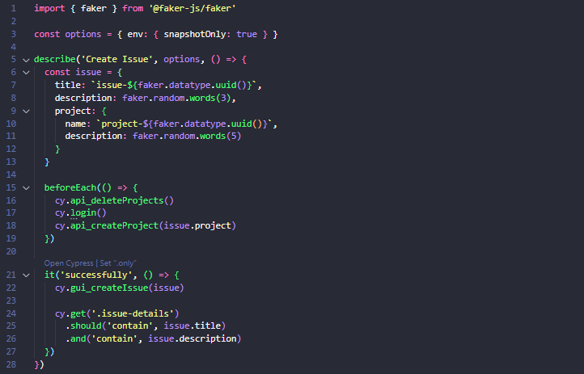
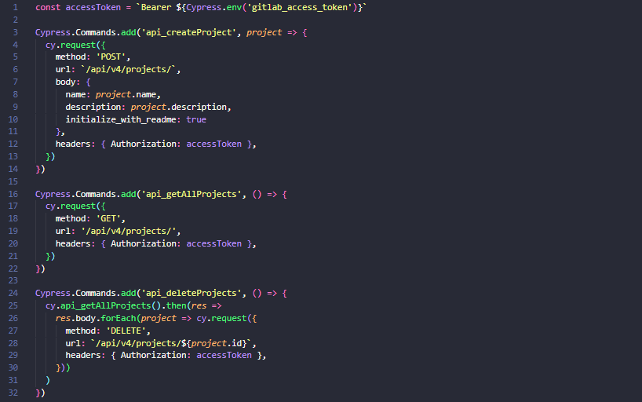

# Talking About Testing | Cypress Intermediário

 
> Cypress intermediário para automação de testes Web - E2E e API REST

 Projeto realizado durante o curso **Cypress Intermediário** da escola online **Talking About Testing**.
 
## 📚 Tópicos

- Como configurar o ambiente local de desenvolvimento usando Docker
- Como instalar e configurar o Cypress
- Como criar testes automatizados de interface gráfica de usuário
- Como criar testes automatizados de API (com feedback visual no navegador)
- Como testar APIs que necessitam um token de acesso
- Como criar testes otimizados e direto-ao-ponto
- Como salvar a sessão do usuário no navegador para posterior restauração
- Como validar se a sessão do usuário ainda é válida e como lidar com isso quando a mesma é invalidada
- Como fazer a limpeza e criação da massa de dados antes do teste começar
- Como proteger dados sensíveis, tais como senhas e tokens de acesso
- Como organizar os testes e comandos customizados em diferentes "camadas" (API, CLI, GUI)
- Como estruturar os testes pensando em pré-condições, ações e resultados esperados
- Como gerar dados aleatórios para uso nos testes automatizados
- Como habilitar funcionalidades experimentais do Cypress
- Como executar comandos à nível de sistema operacional
- Como testar a leitura de arquivos

## 🔧 Ferramentas e Tecnologias

- Docker (`v20.10.13`)
- Cypress (`v12.0.2`)
- Cypress Plugin Api (`v2.6.1`)
- Faker (`v7.6.0`)
- Node.js (`v18.16.0`)
- npm (`v8.19.2`)

## 🔧 Instalação

Execute `npm install` para instalar as dependências de dev.

## 🔧 Testes

Você pode executar testes simulando uma viewport desktop ou mobile:

- ### Desktop

	Execute `npm test` para executar o teste no modo headless.

	Ou `npm run cy:open` para executar o teste no modo interativo.

- ### Mobile

	Execute `npm test:mobile` para executar o teste no modo headless.

	Ou `npm run cy:open:mobile` para executar o teste no modo interativo.

## 🔗 Contato

mykallella@gmail.com
